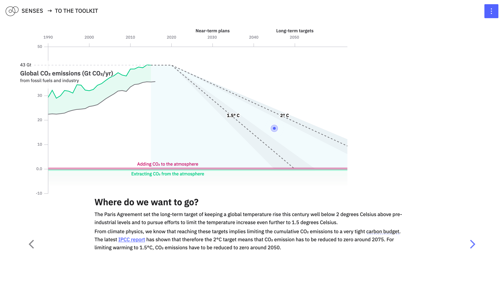
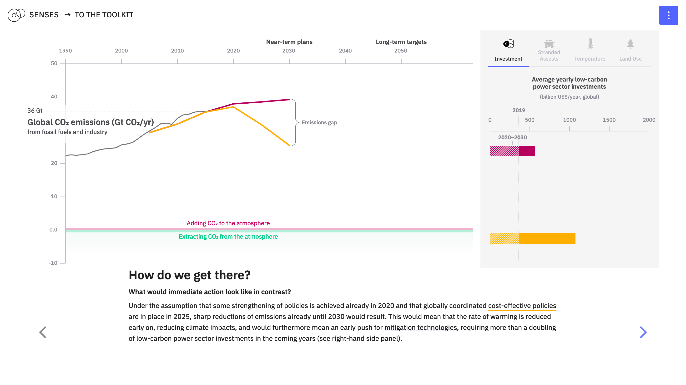
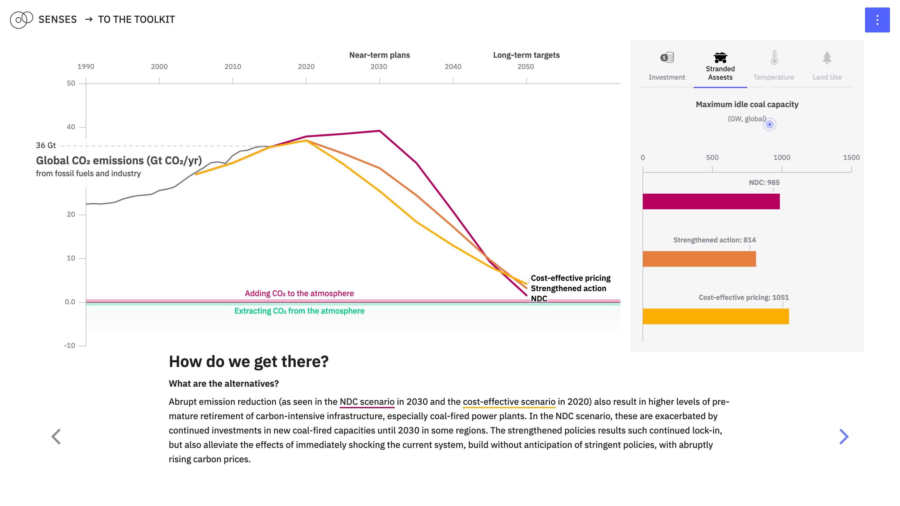
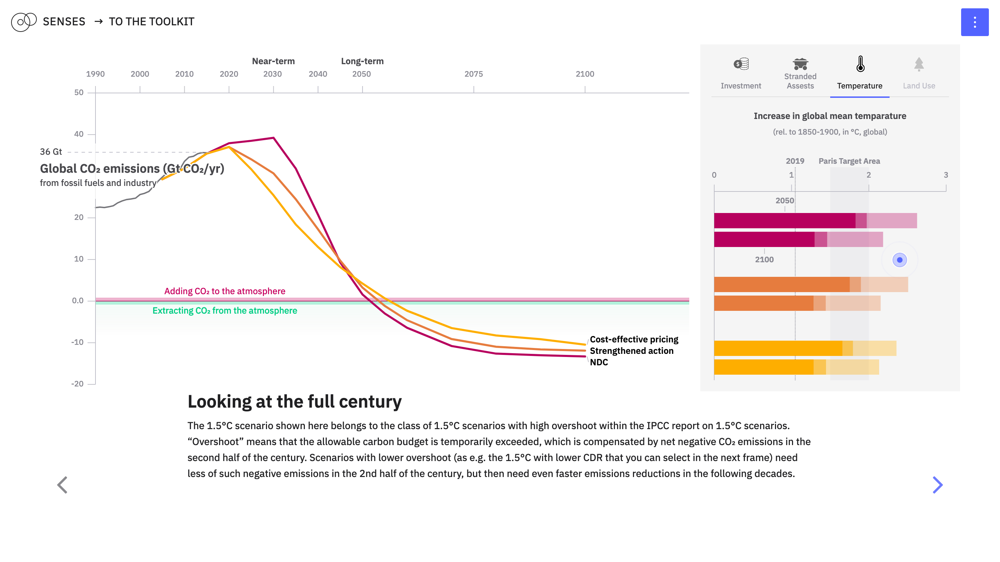

# Closing the emissions gap

Christoph Bertram and Jonas Parnow

In the Paris Agreement of 2015, the international community has agreed to the long-term target of keeping temperature increase to well below 2°C and pursue efforts to even keeping it below 1.5°C. To implement this, the Agreement foresees all countries to periodically submit "Nationally Determined Contributions" (NDC). This learn module explores how the aggregate of the first set of these national decarbonization plans for 2030 relate to the long-term targets, and how additional implementation of strengthened sectoral policies after 2020 could bend the curve further down towards the required trajectory. It illustrates model-based findings as also synthesized in publications like the [UNEP gap report](https://www.unenvironment.org/resources/emissions-gap-report-2019) or earlier in the [UNFCCC synthesis report](https://unfccc.int/process/the-paris-agreement/nationally-determined-contributions/synthesis-report-on-the-aggregate-effect-of-intended-nationally-determined-contributions). It is targeted at stakeholders interested in the international climate policy situation.

---

This repository contains the code for [*Closing the emissions gap*](https://climatescenarios.org/emissions-gap/). It is part of the [SENSES Toolkit](https://climatescenarios.org/).






## License

The source code is licensed under the [ISC license](LICENSE.md). Text and graphics are licensed under [Attribution-ShareAlike 4.0 International](https://creativecommons.org/licenses/by-sa/4.0/). For licensing information on datasets please refer to the data sources section. Exceptions are listed below on a per-file basis.

## Build Setup

``` bash
# install dependencies
$ npm install # Or yarn install

# serve with hot reload at localhost:3000
$ npm run dev

# build for production and launch server
$ npm run build
$ npm start

# generate static project
$ npm run build && npm run generate
```
