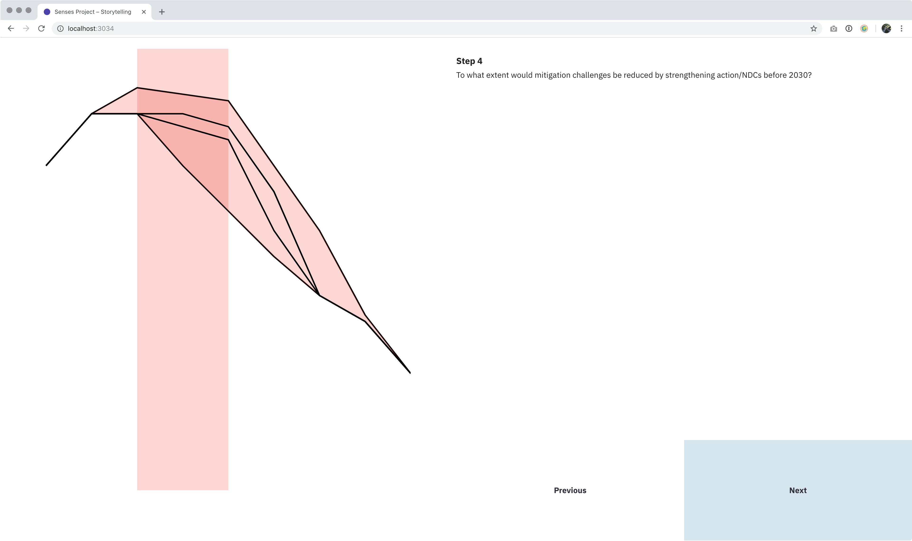

# Senses Storytelling

Step through mulitple steps of a visualisation. Each step can have different view properties.



https://friendly-williams-a07292.netlify.com

## Definitions

### Step

```js
{
  title: 'Are we doing enough?', // title of the step
  clips: { // Clips for the lines, areas, …
    1: 0,
    2: 0,
    3: 0,
    4: 0
  },
  visibility: ['options'], // Which of the elements is visible
  attributes: [], // Which attributes are visible
  data: { // Dataset displayed in this set
    scenario: '2full',
    measure: 'GHG'
  }
}
```

## Build Setup

``` bash
# install dependencies
$ npm install # Or yarn install

# serve with hot reload at localhost:3000
$ npm run dev

# build for production and launch server
$ npm run build
$ npm start

# generate static project
$ npm run generate
```
