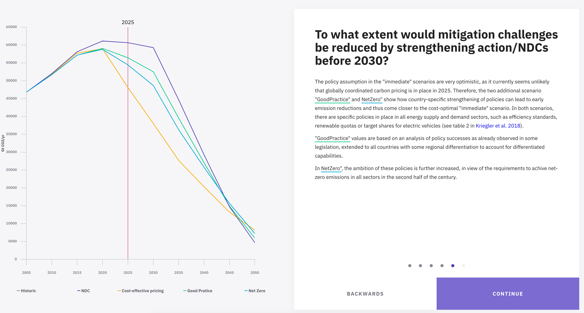

# Senses Storytelling

Step through mulitple steps of a visualisation. Each step can have different view properties.




https://friendly-williams-a07292.netlify.com

## Definitions

### Step

```js
{
  title: 'What is the collective outcome of the NDCs in terms of global emissions in 2030?',
  clips: { // Clips for the policy lines
    NDC: 2030,
    eff: 0,
    goodpractice: 0,
    netzero: 0
  },
  visibility: ['linehistoric', 'area2030', 'markerplateau'], // Which graphical elements are visible
  legend: ['historic', 'NDC'], // Which legend elements are visible
  data: { // Which dataset is selected
    model: 'REMIND-MAgPIE 1.7-3.0',
    scenario: 'PEP',
    degree: '1p5C',
    part: 'full',
    region: 'World',
    variable: 'Emissions|Kyoto Gases'
  }
}
```

## Build Setup

``` bash
# install dependencies
$ npm install # Or yarn install

# serve with hot reload at localhost:3000
$ npm run dev

# build for production and launch server
$ npm run build
$ npm start

# generate static project
$ npm run generate
```
